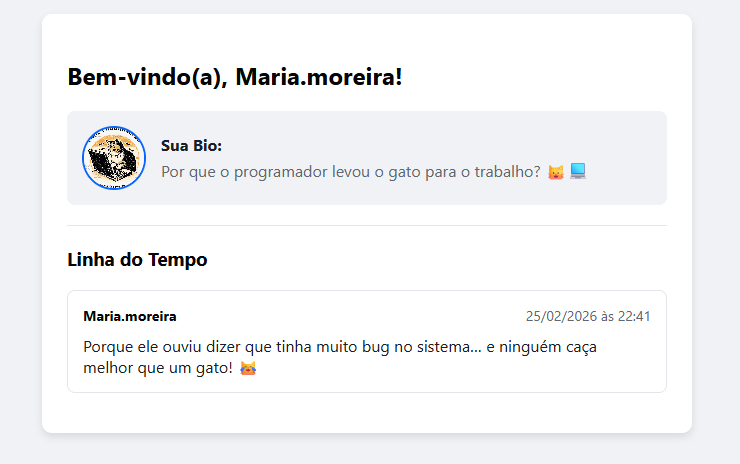

# Microblog 🌐

Um projeto de microblogging desenvolvido em Python utilizando o microframework Flask. Esta aplicação permite que usuários criem contas, façam login, personalizem seus perfis (com foto e biografia) e publiquem mensagens curtas em uma linha do tempo pública.

## 📸 Prévia da Aplicação

*(Nota: Certifique-se de que o arquivo da imagem esteja salvo na mesma pasta do README com o nome `screenshot.png`)*

## ✨ Funcionalidades

* **Autenticação de Usuários:** Cadastro, Login e Logout seguros utilizando `Flask-Login`.
* **Gerenciamento de Sessão:** Controle de rotas protegidas (apenas usuários logados podem postar ou ver a timeline).
* **Perfil Customizável:** Usuários podem adicionar uma URL de imagem para o avatar e uma breve biografia.
* **Linha do Tempo (Timeline):** Exibição dos posts mais recentes ordenados de forma cronológica.
* **Banco de Dados Relacional:** Relacionamento estruturado entre Usuários e Posts (`1:N`) utilizando `SQLAlchemy ORM`.
* **Interface Estilizada:** Design limpo, responsivo e acessível com CSS customizado.

## 🛠️ Tecnologias Utilizadas

* **Backend:** Python 3, Flask
* **Banco de Dados:** SQLite, Flask-SQLAlchemy (ORM)
* **Autenticação:** Flask-Login
* **Frontend:** HTML5, CSS3, Jinja2 (Template Engine)